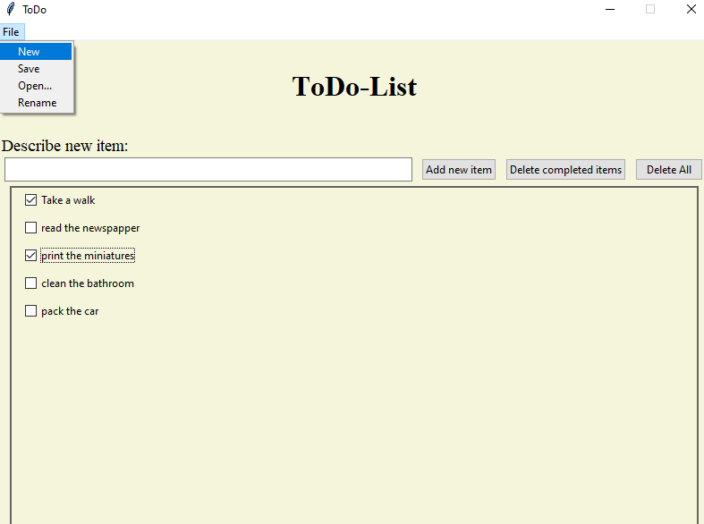

# ToDoList

This is a simple ToDo-list that creates checkboxes when adding a new entry. \
It also have the following functionalities:

- Adding a new entry by either pressing `Enter` or by clicking the button `Add new item`
- Delete all entries by clicking the button `Delete All`
- Delete all entries that are marked as finished by clicking the button `Delete completed items`
- Open a new file
- Save the current file to the current directory
- Open a saved
- Rename the file

